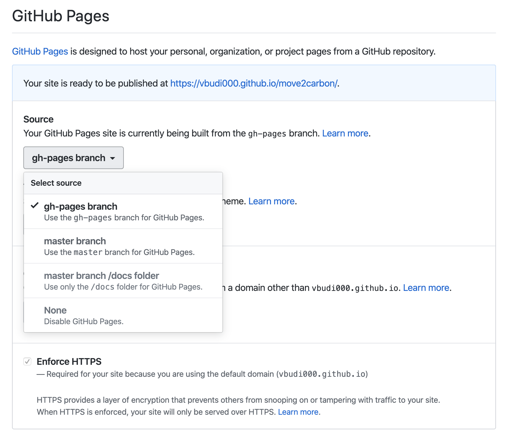

# move2carbon

This repo documents changes that must be made to move an existing documentation repo into Carbon theme.

1. Prepare required files, all these files are available in this repo:

	- package.json
	- gatsby-browser.js
	- gatsby-config.js 

	Specially for `gatsby-config.js` you must modify that specific to your env. The following is a snapshot of the file content:

	```javascript
	module.exports = {
	  siteMetadata: {                       <====== Modify this for site-wide info
	    title: 'Gatsby Theme Carbon',
	    description: 'A Gatsby theme for the carbon design system',
	    keywords: 'gatsby,theme,carbon',
	  },
	  pathPrefix: `/gtc`,                   <====== repo name
	  plugins: [
	    {
	      resolve: 'gatsby-plugin-manifest',
	      options: {
	        name: 'Carbon Design Gatsby Theme',
	        short_name: 'Gatsby Theme Carbon',
	        start_url: '/',
	        background_color: '#ffffff',
	        theme_color: '#0062ff',
	        display: 'browser',
	      },
	    },
	    {
	      resolve: 'gatsby-theme-carbon',
	      options: {
	        isSearchEnabled: true,
	        repository: {
	          baseUrl: 'https://github.com/vbudi000/gtc', <===== repo url
	          subDirectory: '/',                          <===== parent dir for gatsby
	        },
	      },
	    },
	  ],
	};
	```

2. Create and populate the src directory:

	- src/data: contains `nav-items.json` that defines the left navigation pane
	- src/images: style based images and icon (additional images can be loaded here)
	- src/styles: carbon css file - must be there
	- src/gatsby-theme-carbon: additional control files that you must modify to add the navigation functionality
	- src/pages: **ALL** source navigation pane should be under here, an index.* file should exists as the initial page

	Commit all changes to the master branch (or any branch that you need to use).

3. Install and prepare the node.js components:

	```bash
	cd reponame
	npm install gh-pages --save-dev
	npm install sharp node-sass
	npm install
	```

	Note: sharp and node-sass are needed to be installed separately if you are using Mac (automatic install failed for me)

4. Populate content, some restrictions:

	- Content must be formatted properly, no HTML tag should be without closing tag
	- All reference to local repo should be relative, cannot use `{{ site.github.url }}`
	- Path name cannot have a special character (ie `_` or `$` etc)
	- Variables must be properly quoted or escaped 

	For example, for the following files:

	```
	src
	└─ pages
	   ├─ index.md
	   └─ content
	      └─ integration
	         ├─ introduction.md
	         ├─ pre-reqs.md
	         ├─ roks.md
	         └─ onprem-online.md
	```
 
5. Build your nav-items.yaml - note that all md files will be created as a directory and index.html file:

	```yaml
	- title: Home
	  pages:
	    - path: /
	- title: CloudPak for Integration
	  pages:
	    - title: Introduction
	      path: /content/integration/introduction
	    - title: Pre-requisites
	      path: /content/integration/pre-reqs
	    - title: cp4i-on-roks
	      path: /content/integration/roks
	    - title: onprem-online
	      path: /content/integration/onprem-online
	```

6. Set the github pages settings, create the `gh-pages` branch if it does not exist.

	
	Set the github pages settings, typically assign that to the gh-pages branch

7. Deploy the gh-pages:

	```bash
	npm run deploy
	```

To automate the build using travis-ci, see [travis-ci](travis.md).
